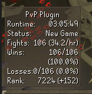
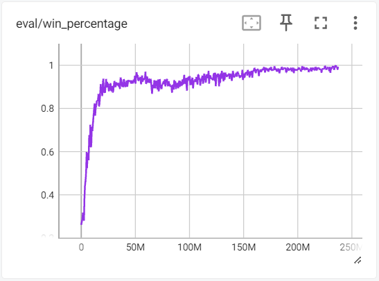
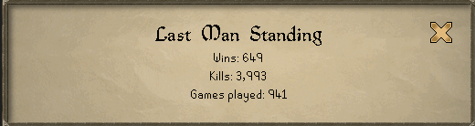
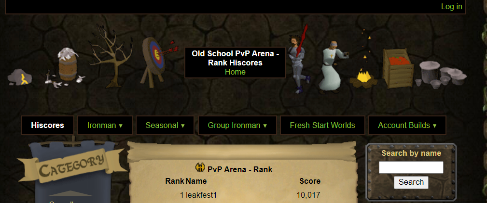
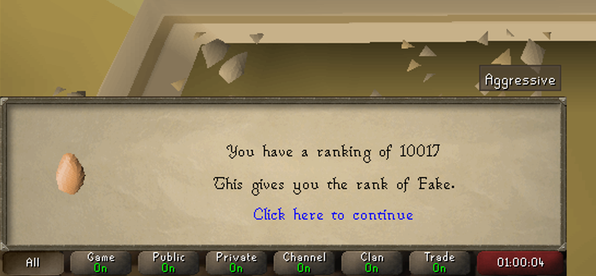

# OSRS PvP Reinforcement Learning

This project leverages deep reinforcement learning, specifically [PPO](https://arxiv.org/pdf/1707.06347.pdf), and
self-play techniques to develop an AI agent capable of mastering 'no honor' player versus player fights
in [Old School RuneScape (OSRS)](https://oldschool.runescape.com/) (such as in Last Man Standing).

**Project Components:**

1. [ML Training System](#pvp-ml)
2. [Game Simulation](#simulation-rsps)

The training system launches and manages the simulation when training, though the simulation can be run on its own too.
The training system also contains an API to serve trained models.

**Note**: A third component for evaluating the models in the live game as a third-party client plugin was developed but
is not publicly available to prevent affecting the real game.

### Showcase

The most recent model version shows incredibly promising results. [FineTunedNh](pvp-ml/models) maintained a
near perfect win rate on the real game in LMS, primarily losing only due to the inherent randomness of the game.

Evaluation session stats:\

Evaluation footage:\

  
View Additional Screenshots

* Win rate against scripted baseline throughout training
  

* LMS! (note: this account was used for testing/data collection too, the final trained model has ~99% win rate)
  

* First to 10k+ PvP Arena rank, and reached #1
  

* In-game PvP Arena rank (the game really says this)
  

# How To Use

1. Clone the repository: `git clone https://github.com/Naton1/osrs-pvp-reinforcement-learning`.
2. Follow the README in each of the two subprojects to set up each project individually.

By following these steps, you'll be able to set up the environment and start training your own AI agent. You'll also
be able to serve the pre-trained models via an API.

## [PvP ML](pvp-ml)

This Python-based component encompasses the core machine learning system. It's the primary interface for training,
orchestrating the entire training workflow, and facilitating connections to the simulation RSPS for training
sessions. The system also includes a socket-based API for real-time predictions.

## [Simulation RSPS](simulation-rsps)

The Simulation RSPS project provides a platform for conducting simulated PvP fights, enhancing the training efficiency
of the agent. It's built on top of a pre-existing private server: [Elvarg RSPS](https://github.com/RSPSApp/elvarg-rsps).

### [Environment Contracts](contracts)

Environment contracts are defined in [contracts/environments](contracts/environments), using JSON files that
describe the actions and observations within each environment. These contracts are used by the two components listed
above.

#### Existing Environment Contracts

* [NH Environment](contracts/environments/NhEnv.json): The primary environment for this project
* [Dharok Edge-Style Environment](contracts/environments/DharokEnv.json): A test environment, partially implemented.

## Train Custom Model

You can train a customized model on the simulation for any defined environment. To train on a new environment, you
can add one ([see below](#add-new-environment)).

Experiment parameters are defined in a YAML file. There are several provided configurations. These configurations
can be customized to produce train new and unique models.

See [start a training job](pvp-ml/README.md#start-training-job) for more detailed
information.

### Add New Environment

You can define a new environment in addition to the pre-existing environments. Use the already-implemented environments
as a reference.

1) Implement the environment contract at [contracts/environments](contracts/environments).
2) Follow the [simulation steps to add a new environment](simulation-rsps/README.md#add-new-environment).
3) Create or update [a training configuration](pvp-ml/config) to use the new environment by setting `env-name`.

## Use Existing Models

To use an existing model via API:

1. Set up the [pvp-ml project](pvp-ml/README.md#how-to-use).
2. Run the [pvp-ml API](pvp-ml/README.md#serve-models-via-api).

## Evaluate Trained Models

To play against the trained models on the simulation:

1. Set up the [pvp-ml project](pvp-ml/README.md#how-to-use).
2. Set up the [simulation-rsps](simulation-rsps/README.md#how-to-use) project and start the server.
3. Start up a RSPS client and [connect to the server](simulation-rsps/README.md#connect-to-server-via-client).
4. Start an [agent evaluation session](pvp-ml/README.md#evaluate-model-on-simulation) for the model.